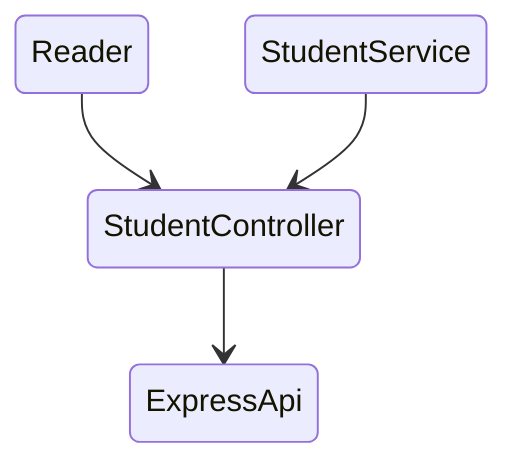
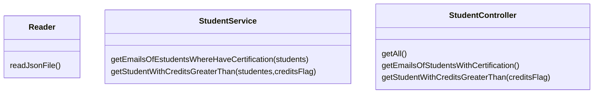

# Code Challengue Launch X Mission NodeJs - Semana 4

## Requerimientos

1. Habilitar un endpoint para consultar todos los estudiantes con todos sus campos.
2. Habilitar un endpoint para consultar los emails de todos los estudiantes que tengan certificación haveCertification.
3. Habilitar un endpoint para consultar todos los estudiantes que tengan credits mayor a 500.

## Endpoints creados

|Endpoint|Request|Response|
|---|---|---|
|localhost:3000/v1/students|localhost:3000/v1/students|Obtiene todos los estudiantes|
|localhost:3000/v1/students/withcertification'|localhost:3000/v1/students/withcertification'|Obtiene los emails de los estudiantes que tienen certificacion|
|localhost:3000/v1/students/withcreditsgrather500|localhost:3000/v1/students withcreditsgrather500|Obtiene todos los estudiantes que tengan credits mayor a 500|


## Componentes de la solución


## Diagrama de clases


## Llamadas a la Api

>curl localhost:3000/v1/students

```json
[
  {
    "id": "6264d5d89f1df827eb84bb23",
    "name": "Warren",
    "email": "Todd@visualpartnership.xyz",
    "credits": 508,
    "enrollments": [
      "Visual Thinking Intermedio",
      "Visual Thinking Avanzado"
    ],
    "previousCourses": 1,
    "haveCertification": true
  },
  {
    "id": "6264d5d85cf81c496446b67f",
    "name": "Lucinda",
    "email": "Sexton@visualpartnership.xyz",
    "credits": 677,
    "enrollments": [
      "Visual Thinking Avanzado"
    ],
    "previousCourses": 6,
    "haveCertification": true
  },
  {
    "id": "6264d5d8cda17de0d2e9f236",
    "name": "Fuentes",
    "email": "Sharlene@visualpartnership.xyz",
    "credits": 210,
    "enrollments": [
      "Visual Thinking Avanzado"
    ],
    "previousCourses": 10,
    "haveCertification": true
  }
  ...continua
```

>curl localhost:3000/v1/students/withcertification

```json
[
  "Todd@visualpartnership.xyz",
  "Sexton@visualpartnership.xyz",
  "Sharlene@visualpartnership.xyz",
  "Howell@visualpartnership.xyz",
  "Haynes@visualpartnership.xyz",
  "Montoya@visualpartnership.xyz",
  "Benton@visualpartnership.xyz",
  "Dionne@visualpartnership.xyz",
  "Mcpherson@visualpartnership.xyz",
  "Gracie@visualpartnership.xyz",
  "Ila@visualpartnership.xyz",
  "Dorthy@visualpartnership.xyz",
  "Mcfarland@visualpartnership.xyz",
  "Maryann@visualpartnership.xyz",
  "Alana@visualpartnership.xyz",
  "Rosemary@visualpartnership.xyz",
  "Keith@visualpartnership.xyz",
  "Delaney@visualpartnership.xyz",
  "Ball@visualpartnership.xyz",
  "Sally@visualpartnership.xyz",
  "Antoinette@visualpartnership.xyz",
  "Juliette@visualpartnership.xyz",
  "Harding@visualpartnership.xyz",
  "Dixon@visualpartnership.xyz",
  "Beulah@visualpartnership.xyz",
  "Moses@visualpartnership.xyz",
  "Shields@visualpartnership.xyz",
  "Jewell@visualpartnership.xyz",
  "Hays@visualpartnership.xyz"
]
```

>curl localhost:3000/v1/students/withcreditsgrather500
```json
[
  {
    "id": "6264d5d89f1df827eb84bb23",
    "name": "Warren",
    "email": "Todd@visualpartnership.xyz",
    "credits": 508,
    "enrollments": [
      "Visual Thinking Intermedio",
      "Visual Thinking Avanzado"
    ],
    "previousCourses": 1,
    "haveCertification": true
  },
  {
    "id": "6264d5d85cf81c496446b67f",
    "name": "Lucinda",
    "email": "Sexton@visualpartnership.xyz",
    "credits": 677,
    "enrollments": [
      "Visual Thinking Avanzado"
    ],
    "previousCourses": 6,
    "haveCertification": true
  },
  {
    "id": "6264d5d8dd1a0be4e249c662",
    "name": "Phillips",
    "email": "Camacho@visualpartnership.xyz",
    "credits": 973,
    "enrollments": [
      "Visual Thinking Intermedio"
    ],
    "previousCourses": 8,
    "haveCertification": false
  },
  {
    "id": "6264d5d8dd01ab97ddedbba5",
    "name": "Taylor",
    "email": "Haynes@visualpartnership.xyz",
    "credits": 652,
    "enrollments": [
      "Visual Thinking Avanzado"
    ],
    "previousCourses": 5,
    "haveCertification": true
  },
  ...continua
```

## Dependencias

Express
>npm install express

Jest
>npm install --save-dev jest

Eslint

Configurado con la guia de estilos de airbnb
>npm install eslint --save-dev


